# sky-net
#### A MERN (MongoDB, Express.js, React.js, Node.js) stack app to display my personal portfolio. [Heroku Deployed](/) 

    
    
    
    
     
    
    
    

 

### A blockchain written in Javascript utilizing websockets through Socket.io.

#### adapted using this tutorial: [Creating a blockchain with Javascript](https://www.youtube.com/watch?v=zVqczFZr124)

 

### Tech Stack - 

    Express.js, React.js, Node.js Socket.io

### Clone the app
    In your terminal run:
    git clone https://github.com/rdrachenberg/sky-net.git

### Start the App
    npm run dev

### NEEDED Enviroment Variables 
    Create a .env file 
    Add the following enviroment variables:

    MINT_PRIVATE_ADDRESS
    MINT_PUBLIC_ADDRESS
    NODE_PRIVATE_KEY

    If you dont have any of keys, you can use the keygen.js file to generate your own. 

### Home Page

 
 
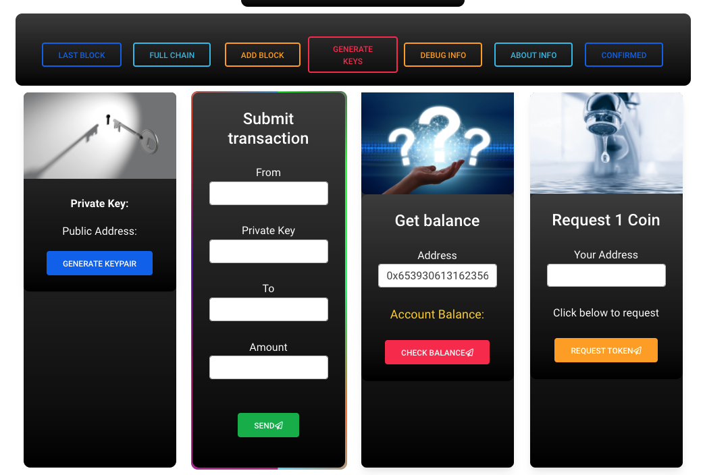
 
 

### Operations

 
 
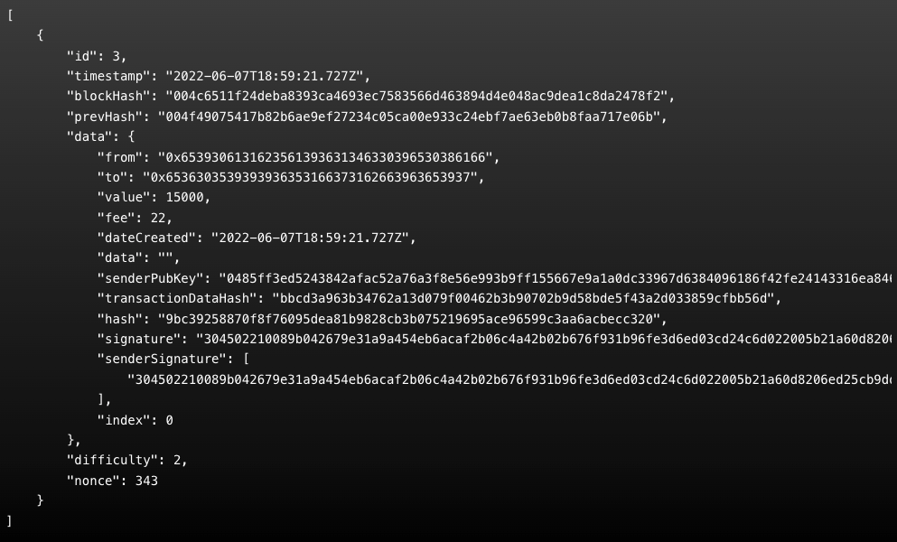
 
 
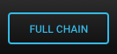
 
 
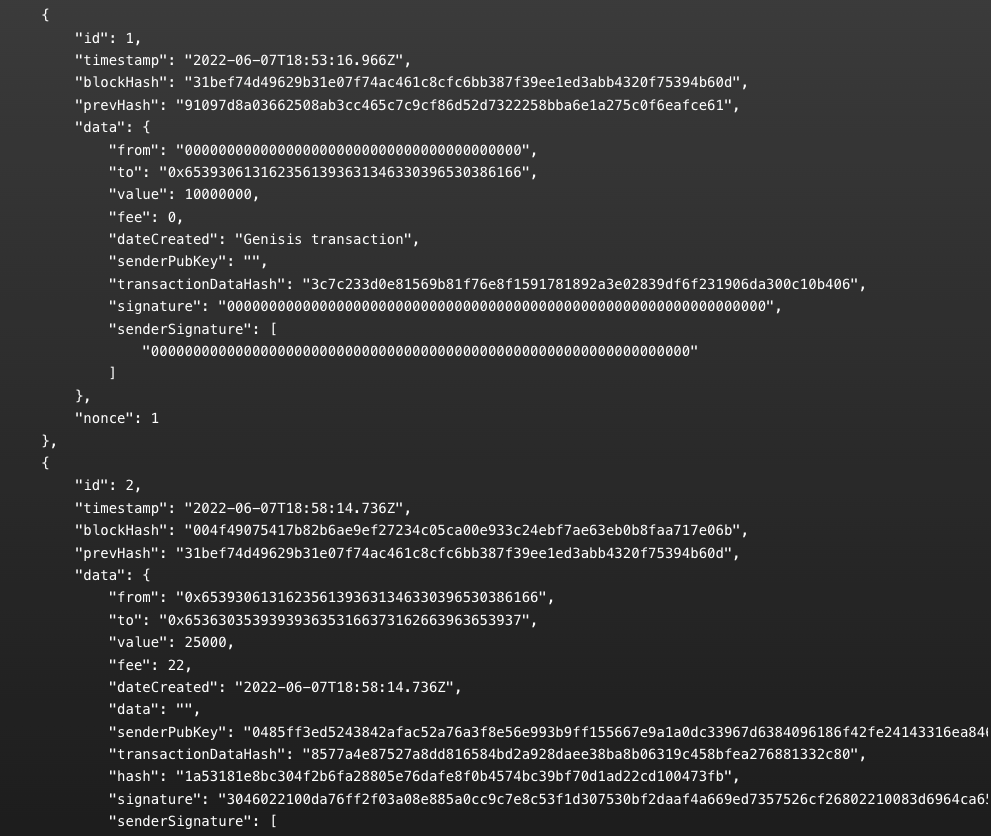
 
 

 
 
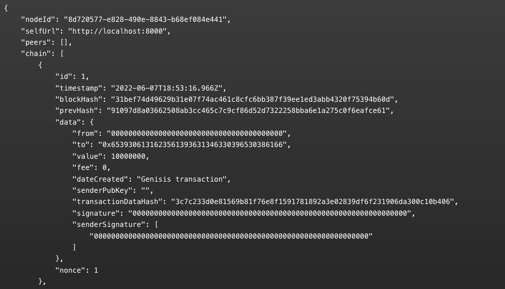
 
 

 
 
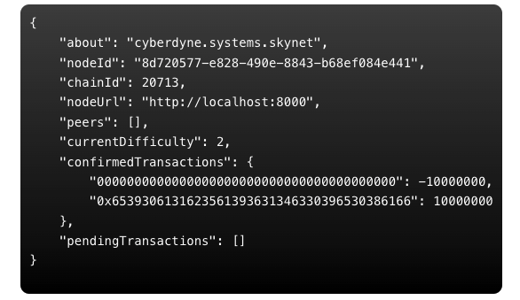
 
 

 
 
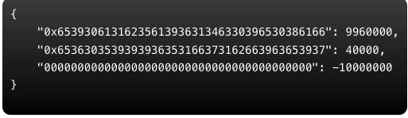
 
 

### Generate Key Pair  
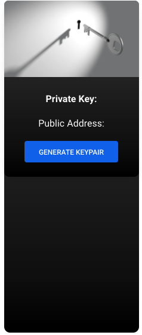
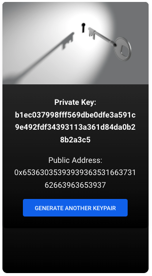
 
 

### Send a Transaction
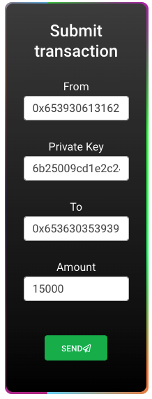
 
Click send, then click the add block button to mine the transaction and add it to the blockchain
 

 
 

### Request a Coin
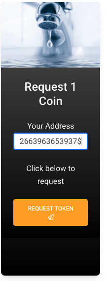
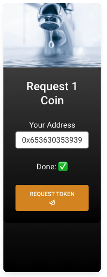
 
 

#### Get the Balance of a Given Address
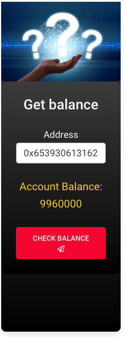
 
 
### Contact Me

 
 

### Root File Structure